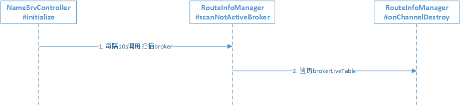
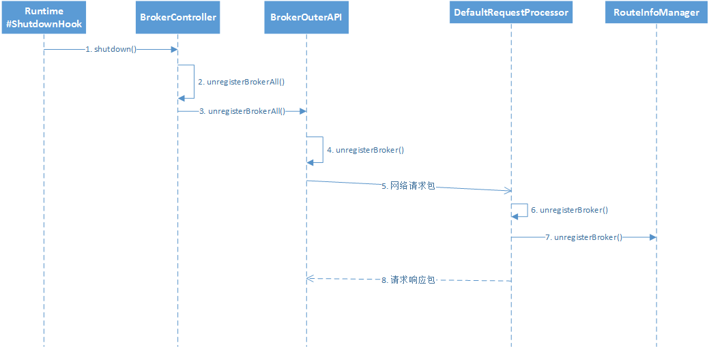

RockMQ有三个触发点来触发路由删除

- NameServer定时扫描`brokerLiveTable`，检测上次心跳包与当前系统时间的时间差，如果大于120s，则需要移除该Broker信息。

`RouteInfoManager.onChannelDestroy`逻辑

1. 遍历`brokerLiveTable`,获取将要移除的broker，如果没有找到，就使用传入的remoteAddr作为要移除的broker；

2. 从`brokerLiveTable`和`filterServerTable`中移除broker；

3. 维护`brokerAddrTable`：遍历`brokerAddrTable`，从`BrokerData`的`brokerAddrs中找到对应的Broker`，并移除；如果`BrokerData`的`brokerAddrs`为空了，则从`brokerAddrTable`中移除`brokerName`对应的条目；

4. 维护`clusterAddrTable`：遍历`clusterAddrTable`，根据BrokerName找到Broker并移除；如果该集群已经不包含任何broker，则将该集群从`clusterAddrTable`中移除

5. 维护`topicQueueTable`：根据BrokerName，遍历所有Topic的队列，如果队列中包含了当前broker的队列，则移除；如果topic不包含队列了，则从`topicQueueTable`中删除该topic。

- Broker在正常关闭的情况下，会执行`unregisterBroker`。

1. 当Broker正常退出时，会调用JVM的钩子函数；

2. 钩子函数中调用`BrokerController.shutdown`

3. `BrokerController#shutdown`调用`unregisterBrokerAll`

4. `BrokerController#unregisterBrokerAll`中遍历`NameServer`，逐个发送注销路由数据包

5. 在NameServer中，由`DefaultRequestProcessor`根据`RequestCode`的不同来处理`Broker`发送的数据包，当接收到`RequestCode.UNREGISTER_BROKER`时，调用`unregisterBroker`进行路由删除

6. `DefaultRequestProcessor#unregisterBroker`转调`RouteInfoManager#unregisterBroker`来进行路由删除

7. 在`RouteInfoManager#unregisterBroker`维护路由表信息:  `brokerLiveTable`, `filterServerTable`,`brokerAddrTable`,`clusterAddrTable`,`topicQueueTable`

- 当NameServer监听到通道关闭，通道异常或通道空闲时，删除路由信息

        NameServer中由`BrokerHousekeepingService`监听通道事件，当监听到

        `ChannelClose`,`ChannelException`.`ChannelIdle`事件时，会调用

        `RouteInfoManager#onChannelDestroy`方法进行路由删除
