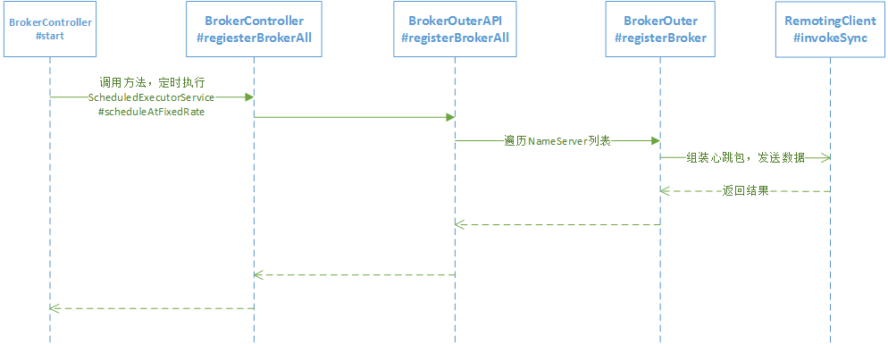
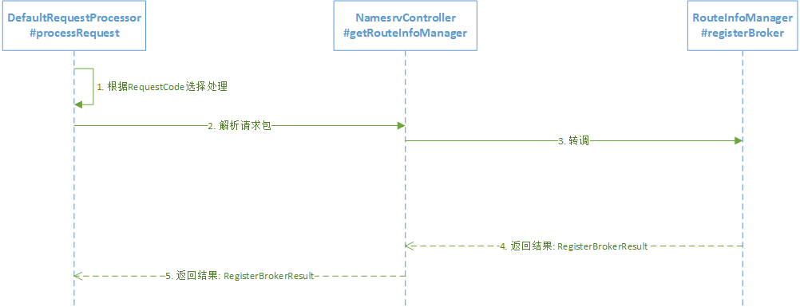

RocketMQ路由注册是通过Broker与NameServer的心跳功能实现的。

- Broker启动时向集群中所有的NameServer发送心跳语句，每隔30s向集群所有NameServer发送心跳包。

- NameServer收到心跳包时会更新`brokerLiveTable`缓存中`BrokerLiveInfo`的`lastUpdateTimestamp`。然后NameServer每隔10s扫描`brokerLiveTable`，如果连续120s没有收到心跳包，NameServer将移除该Broker的路由信息同事关闭Socket连接

## 1、Broker发送心跳包

心跳包由`RegisterBrokerRequestHeader`和`RegisterBrokerBody`组成，`RegisterBrokerRequestHeader`包含：broker地址，brokerId，broker名称，集群名称，haServerAddr；`RegisterBrokerBody`包含：消息过滤服务器列表，Topic配置

## 2、NameServer处理心跳包

NameServer主要由`DefaultRequestProcessor`网络处理器来处理请求，根据请求类型决定处理行为，如果是请求类型为`RequestCode.REGISTER_BROKER`，则请求最终转发到`RouteInfoManager#registerBroker`

### RouteInfoManager#registerBroker

1、添加broker所属集群信息到路由表`clusterAddrTable`

2、添加broker信息到路由表`brokerAddrTable`

3、如果是Master，并且broker topic配置信息发生变化或是初次注册，则需要创建或更新`topicQueueTable`

4、更新`brokerLiveTable`

5、更新`filterServerTable`

